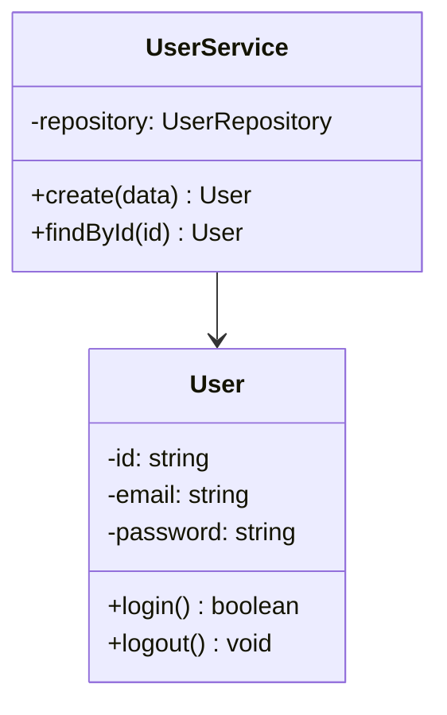

# 클래스 설계 (Class Design)
{: .no_toc }

주요 클래스와 모듈의 구조를 정의합니다.
{: .fs-6 .fw-300 }

---

## 목차
{: .no_toc .text-delta }

1. TOC
{:toc}

---

## 1. 클래스 다이어그램

---

## 2. [도메인] 클래스

<!-- 주요 클래스를 작성하세요 -->

### UserService 클래스

**책임**: 사용자 비즈니스 로직 처리

**속성:**
- `userRepository`: UserRepository
- `emailService`: EmailService

**메서드:**
- `create(data: CreateUserDto): Promise<User>` - 사용자 생성
- `findById(id: string): Promise<User>` - 사용자 조회

---

## ✅ 완료 체크리스트

- [ ] 클래스 다이어그램 작성 완료
- [ ] 주요 클래스 정의 완료
