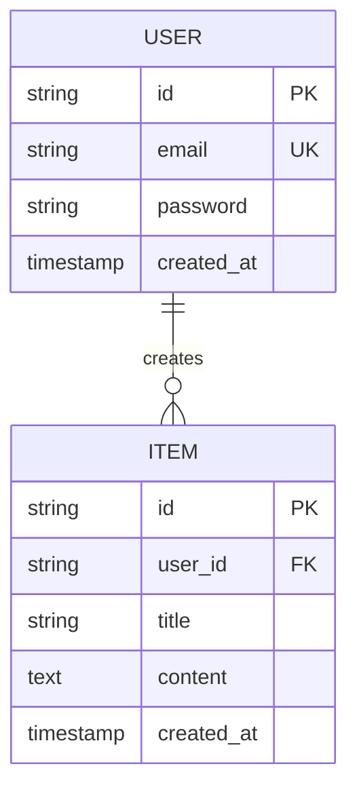

# 데이터 모델 (Data Model)
{: .no_toc }

데이터베이스 스키마와 엔티티 관계를 정의합니다.
{: .fs-6 .fw-300 }

---

## 목차
{: .no_toc .text-delta }

1. TOC
{:toc}

---

## 1. ERD (Entity Relationship Diagram)

---

## 2. 테이블 정의

### users 테이블

| 컬럼명 | 타입 | 제약조건 | 설명 |
|--------|------|----------|------|
| id | UUID | PK | 사용자 ID |
| email | VARCHAR(255) | UNIQUE, NOT NULL | 이메일 |
| password | VARCHAR(255) | NOT NULL | 암호화된 비밀번호 |
| created_at | TIMESTAMP | DEFAULT NOW() | 생성일시 |

**인덱스:**
- `idx_users_email` ON `email`

---

## 3. [추가 테이블]

<!-- 추가 테이블을 작성하세요 -->

---

## ✅ 완료 체크리스트

- [ ] ERD 작성 완료
- [ ] 모든 테이블 정의 완료
- [ ] 인덱스 전략 수립 완료
