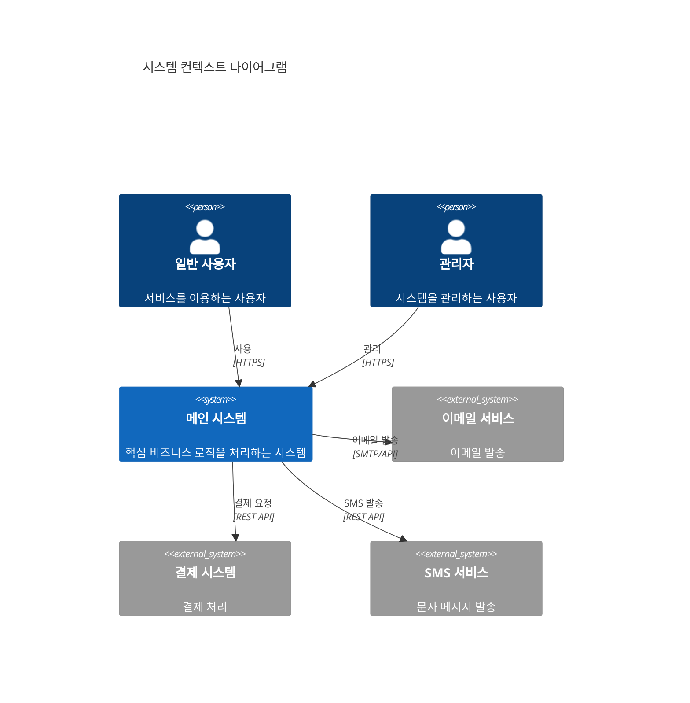
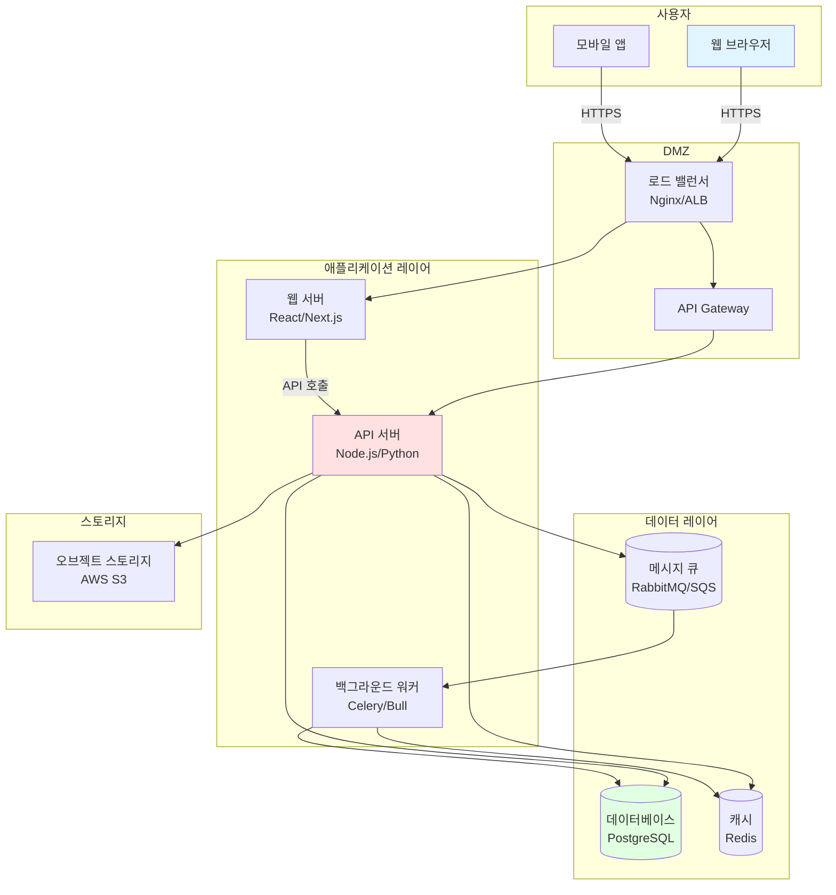
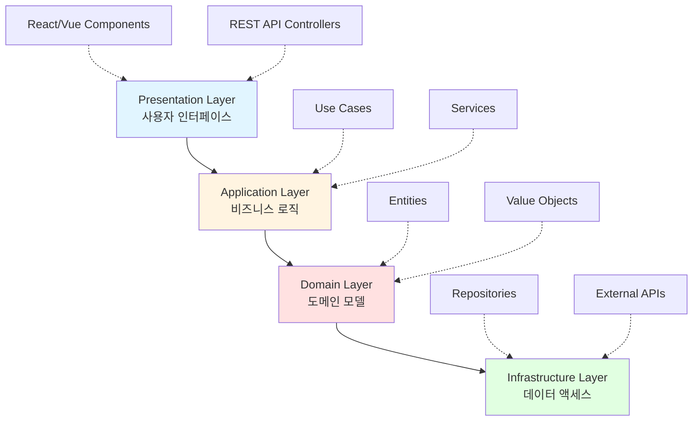
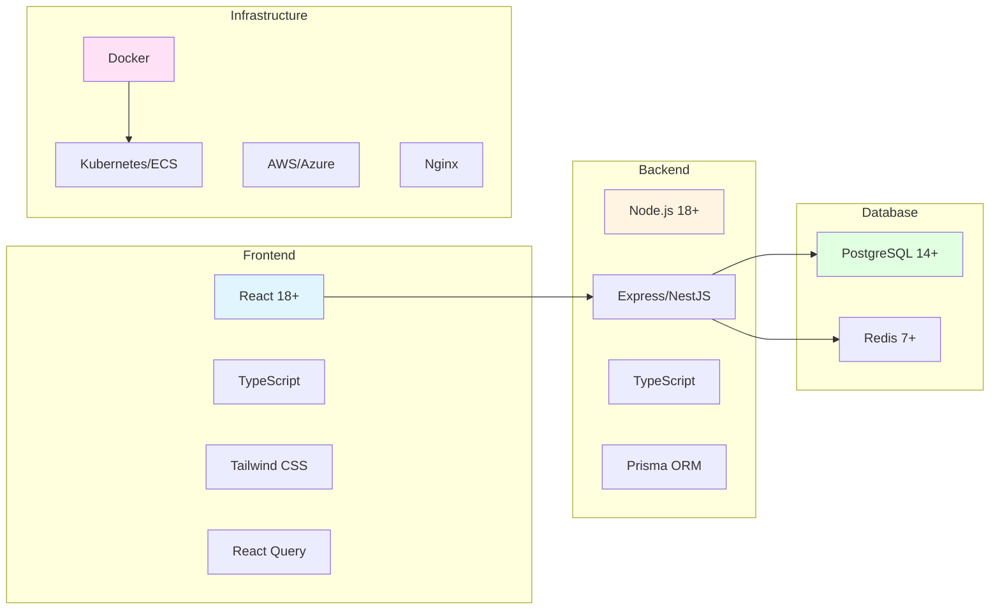
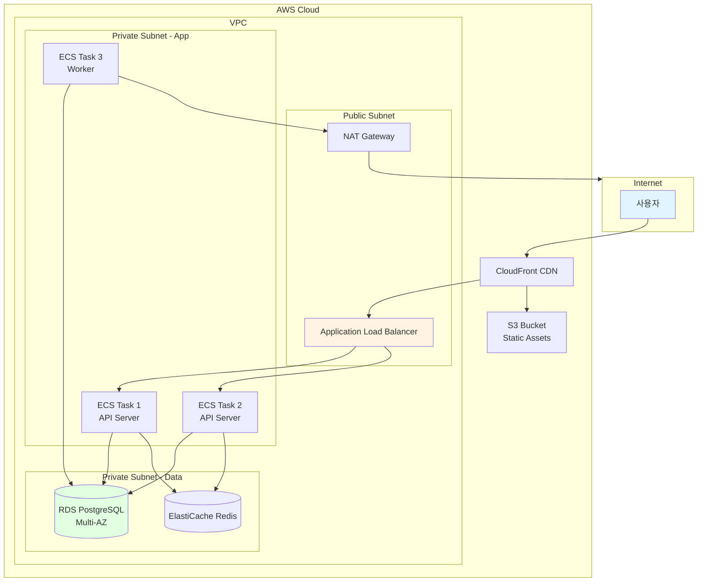
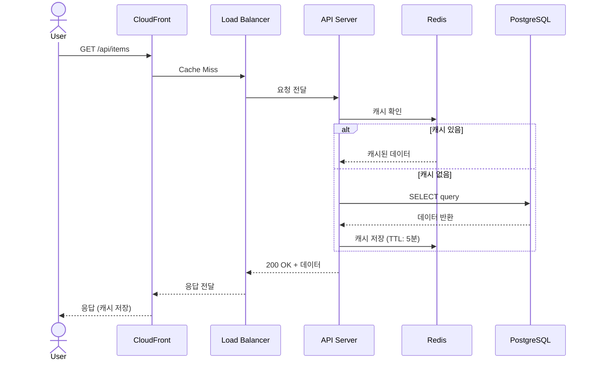
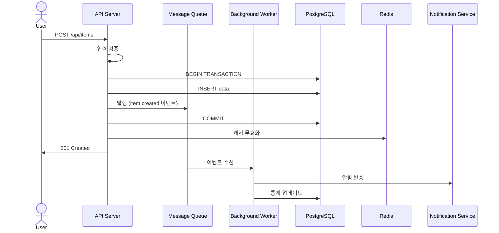
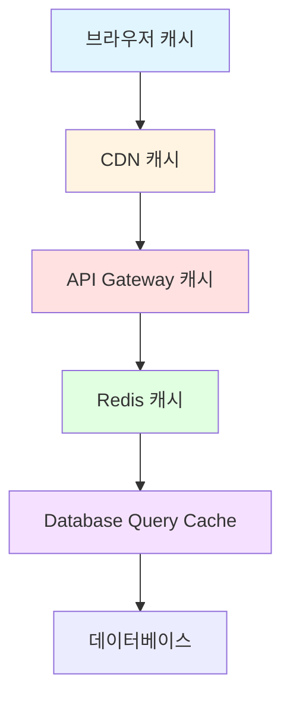
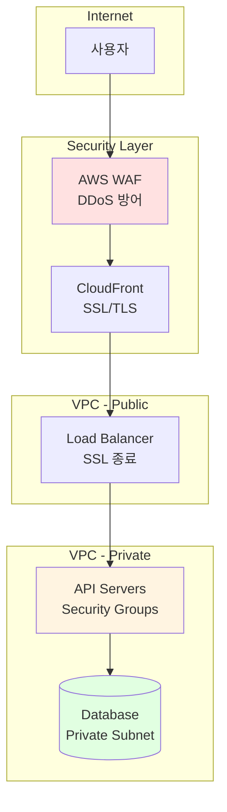

# 시스템 아키텍처 (System Architecture)
{: .no_toc }

전체 시스템의 구조와 기술 스택을 정의합니다.
{: .fs-6 .fw-300 }

---

## 목차
{: .no_toc .text-delta }

1. TOC
{:toc}

---

## 1. 전체 시스템 아키텍처

### 1.1 시스템 컨텍스트 (C4 Level 1)

### 1.2 컨테이너 다이어그램 (C4 Level 2)

---

## 2. 레이어 아키텍처

### 2.1 레이어 구조

### 2.2 레이어별 책임

| 레이어 | 책임 | 기술 스택 |
|--------|------|-----------|
| **Presentation** | UI 렌더링, 사용자 입력 처리 | React, Vue, React Native |
| **Application** | 비즈니스 로직, 트랜잭션 관리 | Express, FastAPI, Django |
| **Domain** | 핵심 비즈니스 규칙, 엔티티 | TypeScript, Python Classes |
| **Infrastructure** | DB 접근, 외부 API 통신 | TypeORM, SQLAlchemy, Prisma |

---

## 3. 기술 스택

### 3.1 전체 기술 스택

### 3.2 상세 기술 스택

#### Frontend
| 구분 | 기술 | 버전 | 용도 |
|------|------|------|------|
| 프레임워크 | React | 18.x | UI 라이브러리 |
| 언어 | TypeScript | 5.x | 타입 안정성 |
| 상태 관리 | Zustand / Redux Toolkit | - | 전역 상태 |
| 데이터 페칭 | TanStack Query | 5.x | 서버 상태 관리 |
| 스타일링 | Tailwind CSS | 3.x | 유틸리티 CSS |
| 폼 관리 | React Hook Form | 7.x | 폼 밸리데이션 |
| 라우팅 | React Router | 6.x | 클라이언트 라우팅 |

#### Backend
| 구분 | 기술 | 버전 | 용도 |
|------|------|------|------|
| 런타임 | Node.js | 18 LTS | 서버 런타임 |
| 프레임워크 | NestJS / Express | 10.x / 4.x | API 서버 |
| 언어 | TypeScript | 5.x | 타입 안정성 |
| ORM | Prisma | 5.x | 데이터베이스 ORM |
| 인증 | Passport.js | 0.7.x | 인증/인가 |
| 밸리데이션 | class-validator | 0.14.x | 입력 검증 |
| API 문서 | Swagger/OpenAPI | 3.0 | API 문서화 |

#### Database & Cache
| 구분 | 기술 | 버전 | 용도 |
|------|------|------|------|
| RDBMS | PostgreSQL | 14+ | 주 데이터베이스 |
| Cache | Redis | 7+ | 세션, 캐싱 |
| 검색 | Elasticsearch | 8.x | 전체 텍스트 검색 (선택) |

#### DevOps & Infrastructure
| 구분 | 기술 | 버전 | 용도 |
|------|------|------|------|
| 컨테이너 | Docker | 24.x | 컨테이너화 |
| 오케스트레이션 | Kubernetes / ECS | - | 컨테이너 관리 |
| CI/CD | GitHub Actions | - | 자동화 |
| 모니터링 | Prometheus + Grafana | - | 메트릭 수집/시각화 |
| 로깅 | ELK Stack | - | 로그 관리 |
| 클라우드 | AWS / Azure | - | 클라우드 인프라 |

---

## 4. 배포 아키텍처

### 4.1 프로덕션 환경

### 4.2 환경별 구성

| 환경 | 용도 | 인스턴스 | Auto Scaling |
|------|------|----------|--------------|
| **Development** | 개발 | t3.small x 1 | 없음 |
| **Staging** | QA/테스트 | t3.medium x 2 | 2-4 |
| **Production** | 운영 | t3.large x 2 | 2-10 |

---

## 5. 데이터 흐름

### 5.1 읽기 흐름

### 5.2 쓰기 흐름

---

## 6. 확장 전략

### 6.1 수평 확장 (Horizontal Scaling)

**애플리케이션 서버**
- Auto Scaling Group 사용
- 메트릭 기반 자동 확장:
  - CPU 사용률 > 70%: Scale Out
  - CPU 사용률 < 30%: Scale In
- 무상태(Stateless) 설계로 인스턴스 추가/제거 자유로움

**데이터베이스**
- Read Replica를 통한 읽기 부하 분산
- Connection Pooling (최소 10, 최대 100)
- 샤딩 전략 (100만 사용자 이상 시)

### 6.2 캐싱 전략

**레벨별 캐싱**

| 레벨 | TTL | 대상 |
|------|-----|------|
| **CDN** | 24시간 | 정적 파일 (JS, CSS, 이미지) |
| **Redis** | 5분 | API 응답 (자주 조회되는 데이터) |
| **DB Query** | 1분 | 집계 쿼리 결과 |

---

## 7. 보안 아키텍처

### 7.1 네트워크 보안

### 7.2 보안 계층

| 계층 | 보안 조치 |
|------|-----------|
| **네트워크** | VPC 격리, Security Groups, NACLs |
| **애플리케이션** | JWT 인증, CORS, Rate Limiting |
| **데이터** | 암호화 (전송: TLS 1.3, 저장: AES-256) |
| **모니터링** | 침입 탐지, 로그 분석, 알림 |

---

## 8. 재해 복구 (DR)

### 8.1 백업 전략

| 데이터 | 백업 주기 | 보관 기간 | RPO |
|--------|-----------|-----------|-----|
| **데이터베이스** | 매시간 (증분), 매일 (전체) | 30일 | 5분 |
| **파일 스토리지** | 매일 | 90일 | 24시간 |
| **설정 파일** | Git 버전 관리 | 영구 | 실시간 |

### 8.2 장애 복구 절차

1. **장애 감지**: 모니터링 시스템 (Prometheus, CloudWatch)
2. **알림 발송**: PagerDuty, Slack, SMS
3. **자동 복구**: Health Check 실패 시 인스턴스 재시작
4. **수동 개입**: 30분 내 복구 불가 시 DR 사이트 활성화

---

## ✅ 완료 체크리스트

- [ ] 전체 시스템 아키텍처 다이어그램 작성 완료
- [ ] 레이어 아키텍처 정의 완료
- [ ] 기술 스택 선정 및 문서화 완료
- [ ] 배포 아키텍처 설계 완료
- [ ] 데이터 흐름 정의 완료
- [ ] 확장 전략 수립 완료
- [ ] 보안 아키텍처 설계 완료
- [ ] DR 전략 수립 완료
- [ ] 아키텍처 리뷰 완료

---

**다음 단계**: [주요 컴포넌트](components/) 설계
