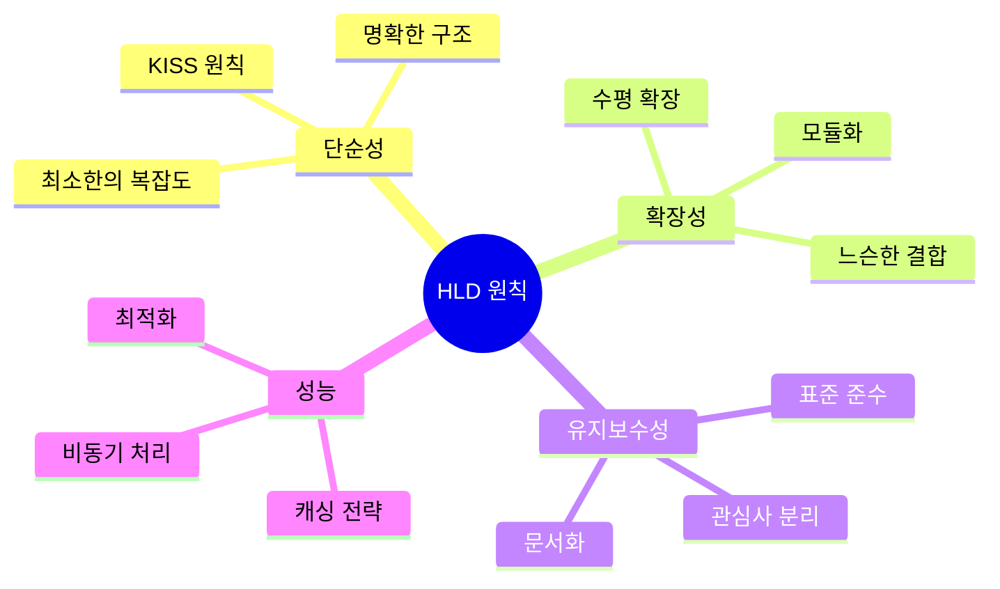
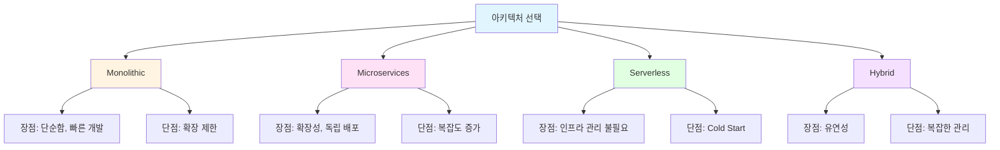

# High Level Design (HLD)
{: .no_toc }

시스템의 전체 아키텍처와 주요 컴포넌트를 설계하는 단계입니다.
{: .fs-6 .fw-300 }

---

## 목차
{: .no_toc .text-delta }

1. TOC
{:toc}

---

## 개요

High Level Design은 요구사항을 바탕으로 시스템의 전체적인 구조를 설계하는 단계입니다. 구현 세부사항보다는 시스템의 전반적인 아키텍처와 주요 컴포넌트 간의 관계에 초점을 맞춥니다.

### 🎯 목적

- 시스템의 전체 구조 정의
- 주요 컴포넌트 및 모듈 식별
- 컴포넌트 간 상호작용 정의
- 기술 스택 및 아키텍처 패턴 선택
- 확장성 및 유지보수성 고려

---

## 📐 HLD 설계 원칙

### 1. 아키텍처 원칙



### 2. 설계 패러다임

| 원칙 | 설명 | 적용 예시 |
|------|------|-----------|
| **관심사의 분리** | 각 컴포넌트는 하나의 책임만 | Presentation, Business, Data Layer |
| **느슨한 결합** | 컴포넌트 간 의존성 최소화 | 인터페이스 기반 통신, 이벤트 기반 |
| **높은 응집도** | 관련 기능은 함께 그룹화 | 도메인 중심 설계 |
| **추상화** | 구현 세부사항 숨김 | API Gateway, 서비스 인터페이스 |

---

## 🏗️ 아키텍처 스타일

### 선택 가능한 아키텍처 패턴



### 선택 기준

| 기준 | Monolithic | Microservices | Serverless |
|------|------------|---------------|------------|
| 팀 크기 | 소규모 (< 5명) | 대규모 (> 10명) | 소규모 |
| 복잡도 | 낮음 | 높음 | 중간 |
| 확장성 | 수직 | 수평 | 자동 |
| 운영 비용 | 낮음 | 높음 | 종량제 |
| 배포 속도 | 느림 | 빠름 | 매우 빠름 |

---

## 📑 문서 구성

### [시스템 아키텍처 (Architecture)](architecture/)
전체 시스템의 구조와 기술 스택을 정의합니다.
- 전체 아키텍처 다이어그램
- 레이어 구조
- 기술 스택 선택
- 배포 아키텍처

### [주요 컴포넌트 (Components)](components/)
시스템을 구성하는 주요 컴포넌트를 정의합니다.
- 컴포넌트 식별 및 역할
- 컴포넌트 간 상호작용
- 데이터 흐름

### [인터페이스 설계 (Interface Design)](interface-design/)
내부/외부 시스템 간 인터페이스를 정의합니다.
- API 설계 원칙
- 외부 시스템 연동
- 메시징 패턴

---

## 🔄 설계 프로세스

### 1단계: 요구사항 분석
```
입력: 요구사항 명세서
↓
출력: 핵심 기능 목록, 비기능 요구사항
```

### 2단계: 아키텍처 패턴 선택
```
입력: 요구사항, 제약사항
↓
고려사항: 확장성, 복잡도, 팀 역량
↓
출력: 아키텍처 스타일 (Monolithic/Microservices 등)
```

### 3단계: 컴포넌트 식별
```
입력: 기능 요구사항
↓
방법: 도메인 분석, 책임 할당
↓
출력: 주요 컴포넌트 목록
```

### 4단계: 인터페이스 정의
```
입력: 컴포넌트 목록
↓
방법: 데이터 흐름 분석
↓
출력: API 명세, 메시지 프로토콜
```

### 5단계: 검증
```
입력: HLD 문서
↓
방법: 아키텍처 리뷰, 시나리오 워크스루
↓
출력: 검증된 HLD, 개선 사항
```

---

## 🤖 AI 활용 팁

HLD 작성 시 AI를 효과적으로 활용하는 방법:

### 1. 아키텍처 패턴 추천
```
프롬프트 예시:
"다음 요구사항에 적합한 아키텍처 패턴을 추천해주세요:
- 예상 사용자: 10,000명
- 핵심 기능: [요약]
- 제약사항: [요약]
각 패턴의 장단점과 선택 이유를 설명해주세요."
```

### 2. 컴포넌트 분해
```
프롬프트 예시:
"다음 기능을 논리적인 컴포넌트로 분해해주세요:
[기능 요구사항 요약]
각 컴포넌트의 역할과 책임을 명확히 해주세요."
```

### 3. 다이어그램 생성
```
프롬프트 예시:
"다음 아키텍처를 Mermaid 다이어그램으로 표현해주세요:
- Frontend: React
- Backend: Node.js API
- Database: PostgreSQL
- Cache: Redis"
```

> 💡 **프롬프트 예시**: `templates/01-hld-prompt.md` 참고

---

## 📊 HLD 품질 체크리스트

### 완전성 (Completeness)
- [ ] 모든 기능 요구사항이 컴포넌트에 매핑됨
- [ ] 모든 비기능 요구사항이 고려됨
- [ ] 외부 시스템 연동이 정의됨

### 일관성 (Consistency)
- [ ] 컴포넌트 간 인터페이스가 명확함
- [ ] 데이터 흐름에 모순이 없음
- [ ] 기술 스택 선택이 일관됨

### 실현 가능성 (Feasibility)
- [ ] 제약사항 내에서 실현 가능함
- [ ] 예산과 일정을 고려함
- [ ] 팀 역량으로 구현 가능함

### 확장성 (Scalability)
- [ ] 수평 확장 가능함
- [ ] 병목 지점이 식별됨
- [ ] 확장 전략이 정의됨

### 유지보수성 (Maintainability)
- [ ] 컴포넌트가 명확히 분리됨
- [ ] 의존성이 최소화됨
- [ ] 변경 영향 범위가 제한적임

---

## 🎨 다이어그램 가이드

HLD에서 사용하는 주요 다이어그램 유형:

### 1. 시스템 컨텍스트 다이어그램
- **목적**: 시스템과 외부 엔티티 간 관계
- **도구**: C4 Model Level 1

### 2. 컨테이너 다이어그램
- **목적**: 시스템 내 주요 컨테이너 (애플리케이션, 데이터베이스)
- **도구**: C4 Model Level 2

### 3. 컴포넌트 다이어그램
- **목적**: 컨테이너 내 주요 컴포넌트
- **도구**: C4 Model Level 3

### 4. 시퀀스 다이어그램
- **목적**: 컴포넌트 간 상호작용 흐름
- **도구**: Mermaid Sequence Diagram

### 5. 배포 다이어그램
- **목적**: 물리적/논리적 배포 구조
- **도구**: Mermaid Graph

---

## 🔗 관련 문서

- **입력**: [요구사항 (Requirements)](../requirements/)
- **출력**: [Detailed Level Design (DLD)](../dld/)
- **참조**: [테스트 전략 (Test Strategy)](../test-strategy/)

---

## 📚 참고 자료

- [C4 Model](https://c4model.com/) - 아키텍처 다이어그램 표준
- [12 Factor App](https://12factor.net/) - 클라우드 네이티브 앱 원칙
- [Microservices Patterns](https://microservices.io/patterns/) - 마이크로서비스 패턴
- [System Design Primer](https://github.com/donnemartin/system-design-primer) - 시스템 설계 가이드

---

## ✅ 완료 체크리스트

- [ ] 아키텍처 패턴 선택 완료
- [ ] 전체 시스템 다이어그램 작성 완료
- [ ] 주요 컴포넌트 식별 완료
- [ ] 컴포넌트 간 인터페이스 정의 완료
- [ ] 기술 스택 결정 완료
- [ ] 아키텍처 리뷰 완료
- [ ] 이해관계자 승인 완료

---

**다음 단계**: [시스템 아키텍처](architecture/) 작성부터 시작하세요.
