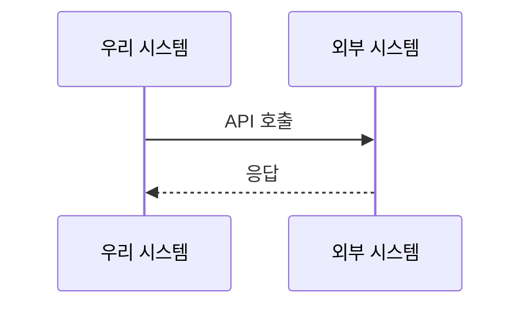

# 인터페이스 설계 (Interface Design)
{: .no_toc }

내부/외부 시스템 간 인터페이스를 정의합니다.
{: .fs-6 .fw-300 }

---

## 목차
{: .no_toc .text-delta }

1. TOC
{:toc}

---

## 1. API 설계 원칙

<!-- 프로젝트의 API 설계 철학과 원칙을 작성하세요 -->

- **RESTful 원칙 준수**
- **일관된 네이밍 규칙**
- **버전 관리 전략**
- **에러 처리 표준**

---

## 2. API 엔드포인트

<!-- 주요 API 엔드포인트를 정의하세요 -->

### 2.1 [도메인명] API (예: 인증 API)

| 메서드 | 경로 | 설명 | 인증 필요 |
|--------|------|------|-----------|
| POST | `/api/v1/auth/login` | 로그인 | ❌ |
| POST | `/api/v1/auth/register` | 회원가입 | ❌ |
| GET | `/api/v1/users/me` | 내 정보 조회 | ✅ |

**예시 요청/응답:**
```json
// POST /api/v1/auth/login
{
  "email": "user@example.com",
  "password": "password123"
}

// 200 OK
{
  "accessToken": "eyJhbGc...",
  "refreshToken": "eyJhbGc...",
  "user": {
    "id": "123",
    "email": "user@example.com"
  }
}
```

---

## 3. 외부 시스템 연동

<!-- 외부 시스템과의 통신 방식을 정의하세요 -->

### 3.1 [외부 시스템명]



**연동 정보:**
- **프로토콜**: REST API / SOAP / GraphQL
- **인증**: API Key / OAuth 2.0
- **Rate Limit**: [제한 사항]

---

## ✅ 완료 체크리스트

- [ ] API 설계 원칙 정의 완료
- [ ] 주요 엔드포인트 정의 완료
- [ ] 외부 시스템 연동 방식 정의 완료
