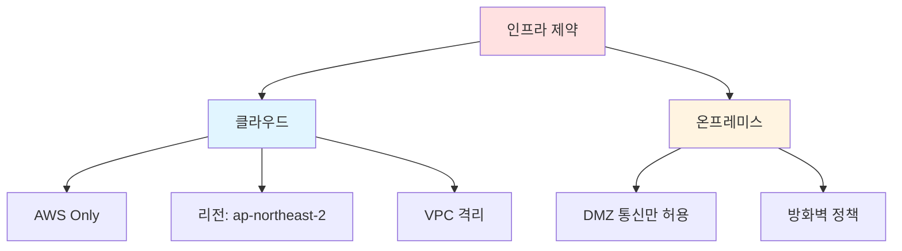
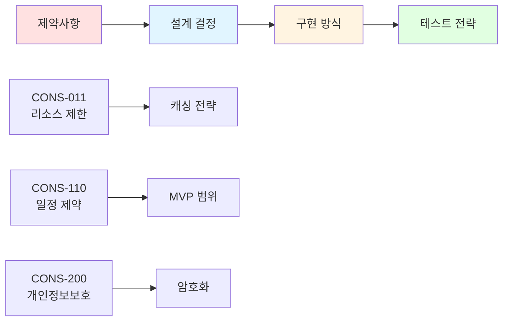

# 제약사항 (Constraints)
{: .no_toc }

프로젝트 수행 시 고려해야 할 제한사항을 정의합니다.
{: .fs-6 .fw-300 }

---

## 목차
{: .no_toc .text-delta }

1. TOC
{:toc}

---

## 개요

제약사항은 프로젝트의 설계와 구현에 영향을 미치는 제한 요소들을 명시합니다. 이러한 제약사항을 고려하지 않으면 프로젝트 실패의 원인이 될 수 있습니다.

---

## 1. 기술적 제약사항 (Technical Constraints)

### 1.1 기술 스택 제약

**CONS-001: 프로그래밍 언어**
- **제약**: Python 3.9+ 또는 Node.js 18+ 사용
- **이유**: 팀의 기술 스택 및 운영 환경
- **영향**: 라이브러리 선택, 개발 생산성

**CONS-002: 프레임워크**
- **제약**:
  - Backend: Django 4.x / FastAPI / Express.js
  - Frontend: React 18+ / Vue 3+
- **이유**: 기존 시스템과의 통합성
- **영향**: 아키텍처 설계, 개발 방식

**CONS-003: 데이터베이스**
- **제약**: PostgreSQL 13+ 또는 MySQL 8.0+
- **이유**: 기존 인프라 및 운영팀 전문성
- **영향**: 데이터 모델 설계, 쿼리 최적화

### 1.2 인프라 제약

**CONS-010: 클라우드 플랫폼**
- **제약**: AWS 또는 Azure (하이브리드 불가)
- **이유**: 기업 계약 및 보안 정책
- **영향**: 서비스 선택, 배포 전략

**CONS-011: 서버 리소스**
- **제약**:
  - 개발: t3.medium (2 vCPU, 4GB RAM)
  - 스테이징: t3.large (2 vCPU, 8GB RAM)
  - 프로덕션: m5.xlarge (4 vCPU, 16GB RAM)
- **이유**: 예산 제약
- **영향**: 성능 최적화 필요성

**CONS-012: 네트워크**
- **제약**:
  - 외부 API 호출 불가 (화이트리스트 방식)
  - 특정 포트만 개방 (80, 443, 22)
- **이유**: 보안 정책
- **영향**: 외부 서비스 통합 제한

### 1.3 레거시 시스템 제약

**CONS-020: 기존 시스템 연동**
- **제약**: SOAP API 사용 (REST API 없음)
- **이유**: 레거시 시스템 (10년 이상)
- **영향**: 어댑터 패턴 필요, 성능 저하 가능

**CONS-021: 데이터 마이그레이션**
- **제약**:
  - 야간(02:00-06:00)에만 작업 가능
  - 중단 시간 < 2시간
- **이유**: 비즈니스 운영 연속성
- **영향**: 단계적 마이그레이션 전략 필요

---

## 2. 비즈니스 제약사항 (Business Constraints)

### 2.1 예산 제약

**CONS-100: 개발 예산**
- **제약**: 총 예산 5,000만원
  - 인건비: 3,500만원
  - 인프라: 1,000만원
  - 라이선스: 500만원
- **이유**: 경영진 승인 예산
- **영향**:
  - 오픈소스 우선 사용
  - 인력 규모 제한
  - 클라우드 비용 최적화

**CONS-101: 운영 예산**
- **제약**: 월 운영비 200만원 이내
- **이유**: 지속 가능한 운영
- **영향**:
  - Auto Scaling 신중한 설정
  - 비용 모니터링 필수

### 2.2 일정 제약

**CONS-110: 출시 일정**
- **제약**: 6개월 내 MVP 출시
  - 2개월: 설계 및 개발 환경 구축
  - 3개월: 개발
  - 1개월: 테스트 및 배포
- **이유**: 시장 진입 시기
- **영향**:
  - 기능 우선순위 엄격히 적용
  - 애자일 개발 방법론 적용

**CONS-111: 마일스톤**
| 단계 | 기한 | 산출물 |
|------|------|--------|
| 요구사항 분석 | 2주 | 요구사항 명세서 |
| HLD | 3주 | 아키텍처 설계서 |
| DLD | 3주 | 상세 설계서 |
| 개발 | 12주 | 기능 구현 |
| 테스트 | 4주 | 테스트 리포트 |
| 배포 | 2주 | 프로덕션 배포 |

### 2.3 인력 제약

**CONS-120: 팀 구성**
- **제약**:
  - Backend 개발자 2명
  - Frontend 개발자 1명
  - DevOps 1명 (겸직)
- **이유**: 인력 예산
- **영향**:
  - 개발 범위 조정
  - 자동화 중요성 증대

**CONS-121: 운영 인력**
- **제약**: 전담 운영팀 없음
- **이유**: 초기 스타트업
- **영향**:
  - 자동화 필수
  - 모니터링 및 알림 시스템 중요

---

## 3. 법적/규제 제약사항 (Legal/Regulatory Constraints)

### 3.1 개인정보보호

**CONS-200: 개인정보보호법**
- **제약**:
  - 개인정보 수집 시 명시적 동의
  - 개인정보 처리방침 공개
  - 제3자 제공 시 별도 동의
- **이유**: 법적 의무
- **영향**:
  - 동의 프로세스 설계
  - 개인정보 암호화
  - 접근 로그 기록

**CONS-201: 데이터 보관**
- **제약**:
  - 최소 보관 기간: 3년
  - 불필요한 데이터 즉시 파기
- **이유**: 전자상거래법, 통신비밀보호법
- **영향**:
  - 자동 삭제 정책
  - 백업 전략

### 3.2 보안 규정

**CONS-210: 정보보안 정책**
- **제약**:
  - ISO 27001 준수
  - 연 1회 보안 감사
  - 취약점 스캔 월 1회
- **이유**: 기업 보안 정책
- **영향**:
  - 보안 개발 생명주기 (SDL)
  - 정기적인 보안 패치

**CONS-211: 접근 제어**
- **제약**:
  - VPN 접속 필수
  - IP 화이트리스트
  - 2단계 인증 (2FA)
- **이유**: 내부 보안 정책
- **영향**:
  - 접근 제어 시스템 구현
  - 인증 프로세스 복잡도 증가

### 3.3 저작권 및 라이선스

**CONS-220: 오픈소스 라이선스**
- **제약**:
  - GPL 라이선스 사용 금지
  - 허용 라이선스: MIT, Apache 2.0, BSD
- **이유**: 법무팀 검토 결과
- **영향**:
  - 라이브러리 선택 제한
  - 라이선스 검토 프로세스

---

## 4. 환경적 제약사항 (Environmental Constraints)

### 4.1 사용자 환경

**CONS-300: 네트워크 환경**
- **제약**:
  - 일부 사용자 3G 환경
  - 평균 대역폭: 5Mbps
- **이유**: 사용자 통계
- **영향**:
  - 번들 크기 최적화
  - 이미지 압축
  - Progressive Web App 고려

**CONS-301: 디바이스**
- **제약**:
  - 모바일: 3년 이상 된 기기 지원
  - 최소 사양: iPhone 8, Galaxy S8
- **이유**: 사용자 기기 현황
- **영향**:
  - 성능 최적화
  - 폴리필 포함

### 4.2 운영 환경

**CONS-310: 데이터센터**
- **제약**:
  - 단일 가용 영역 (Single AZ)
  - 백업: 다른 리전
- **이유**: 비용 절감
- **영향**:
  - 가용성 제한 (99.5%)
  - 재해 복구 계획 필수

**CONS-311: 외부 의존성**
- **제약**:
  - 외부 API 응답 시간 > 2초 (레거시)
  - 외부 시스템 가동률 95%
- **이유**: 레거시 시스템 의존
- **영향**:
  - 비동기 처리 필수
  - 재시도 로직
  - Circuit Breaker 패턴

---

## 5. 조직적 제약사항 (Organizational Constraints)

### 5.1 개발 프로세스

**CONS-400: 승인 프로세스**
- **제약**:
  - 설계 변경: 아키텍트 승인 필요
  - 프로덕션 배포: 팀장 승인 필요
- **이유**: 위험 관리
- **영향**:
  - 승인 대기 시간 고려
  - 긴급 패치 프로세스 별도

**CONS-401: 개발 도구**
- **제약**:
  - IDE: 자유 (VS Code, IntelliJ 권장)
  - 버전 관리: GitHub Enterprise
  - 프로젝트 관리: Jira
- **이유**: 기업 표준
- **영향**:
  - 도구 통합
  - 워크플로우 자동화

### 5.2 문서화 요구사항

**CONS-410: 필수 문서**
- **제약**:
  - 설계서 (HLD, DLD)
  - API 문서 (OpenAPI)
  - 운영 매뉴얼
  - 장애 대응 절차서
- **이유**: 조직 표준
- **영향**:
  - 문서 작성 시간 확보
  - 문서 자동화 도구 활용

---

## 6. 가정 사항 (Assumptions)

제약사항을 정의하면서 다음 사항들을 가정합니다:

**ASM-001: 사용자 증가율**
- 월 평균 20% 증가 예상
- 1년 후 10,000명 → 77,000명

**ASM-002: 데이터 증가율**
- 사용자당 평균 100MB 데이터
- 1년 후 총 7.7TB

**ASM-003: 외부 서비스**
- 외부 API 가용성 99.9% 유지
- 외부 API 정책 변경 없음 (최소 3개월 사전 공지)

**ASM-004: 기술 지원**
- 사용 중인 프레임워크/라이브러리가 프로젝트 기간 동안 지속 지원됨
- 보안 패치 및 버그 수정 정기 제공

---

## 7. 제약사항 완화 전략

### 우선순위별 완화 방안

| 제약사항 ID | 제약 내용 | 영향도 | 완화 전략 |
|-------------|-----------|--------|-----------|
| CONS-011 | 서버 리소스 제한 | 🔴 High | 캐싱, 쿼리 최적화, CDN 활용 |
| CONS-110 | 6개월 출시 기한 | 🔴 High | MVP 범위 축소, 애자일 방법론 |
| CONS-020 | SOAP API 연동 | 🟡 Medium | 어댑터 패턴, 비동기 처리 |
| CONS-300 | 3G 환경 지원 | 🟡 Medium | PWA, 코드 스플리팅 |
| CONS-120 | 인력 제한 | 🟢 Low | 자동화, 코드 재사용 |

---

## 8. 제약사항 추적

### 설계 결정에 미치는 영향

---

## ✅ 완료 체크리스트

- [ ] 모든 기술적 제약사항 식별 완료
- [ ] 비즈니스 제약사항 확인 완료
- [ ] 법적/규제 제약사항 검토 완료
- [ ] 가정 사항 문서화 완료
- [ ] 완화 전략 수립 완료
- [ ] 이해관계자 합의 완료

---

**다음 단계**: [High Level Design (HLD)](../hld/) 작성
