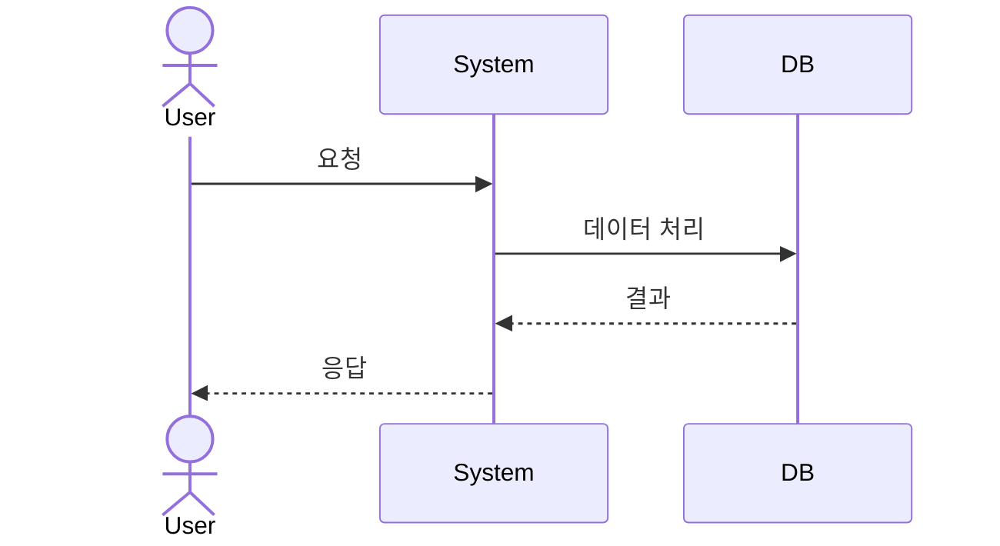
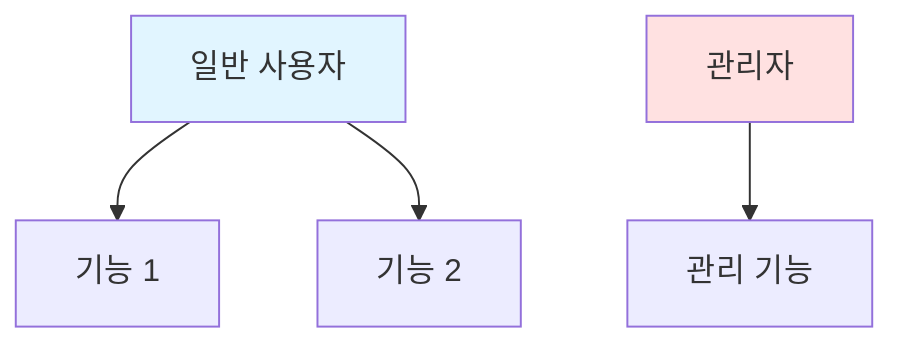

# 기능 요구사항 (Functional Requirements)
{: .no_toc }

시스템이 **무엇을** 해야 하는지 정의하는 문서입니다.
{: .fs-6 .fw-300 }

---

## 목차
{: .no_toc .text-delta }

1. TOC
{:toc}

---

## 개요

기능 요구사항은 사용자가 시스템을 통해 수행할 수 있는 기능과 시스템의 동작 방식을 구체적으로 기술합니다.

---

## 1. 사용자 스토리

### 사용자 역할 정의

| 역할 | 설명 | 권한 |
|------|------|------|
| **일반 사용자** | 기본 기능을 사용하는 사용자 | 읽기, 생성 |
| **관리자** | 시스템을 관리하는 사용자 | 전체 권한 |
| **게스트** | 비회원 사용자 | 제한적 읽기 |

### User Story Template

```
As a [역할],
I want to [기능],
So that [목적/이유].

Acceptance Criteria:
- [ ] 조건 1
- [ ] 조건 2
- [ ] 조건 3
```

---

## 2. 핵심 기능 (Core Features)

<!-- 프로젝트의 핵심 기능을 도메인별로 그룹화하여 작성하세요 -->

### 2.1 [기능 그룹명] (예: 사용자 인증 및 권한 관리)

**FR-001: [기능명]** (예: 사용자 회원가입)
- **설명**: [기능에 대한 명확한 설명]
- **우선순위**: 🔴 Must have / 🟡 Should have / 🟢 Could have / ⚪ Won't have
- **입력**:
  - [입력 데이터 1]
  - [입력 데이터 2]
- **처리**:
  1. [처리 단계 1]
  2. [처리 단계 2]
- **출력**:
  - 성공: [성공 시 결과]
  - 실패: [실패 시 결과]
- **예외 처리**:
  - [예외 상황 1]: [처리 방법]

**예시:**
```
FR-001: 사용자 로그인
- 설명: 사용자는 이메일과 비밀번호로 로그인할 수 있다.
- 우선순위: 🔴 Must have
- 입력: 이메일, 비밀번호
- 처리: 인증 확인 → JWT 토큰 발급
- 출력: 액세스 토큰, 리프레시 토큰
```

---

### 2.2 [기능 그룹명] (예: 데이터 관리)

<!-- 시퀀스 다이어그램이 필요한 경우 작성 -->


**FR-010: [기능명]**
- **설명**: [기능 설명]
- **우선순위**: [우선순위 선택]
- **입력**: [입력 정보]
- **출력**: [출력 정보]

<!-- 추가 기능 작성... -->

---

## 3. Use Case 다이어그램

<!-- 사용자와 시스템 간 상호작용을 다이어그램으로 표현하세요 -->



---

## 4. 비즈니스 규칙

<!-- 시스템이 따라야 하는 비즈니스 규칙을 작성하세요 -->

**BR-001: [규칙명]**
- [규칙 내용]

**예시:**
```
BR-001: 데이터 소유권
- 사용자는 자신이 생성한 데이터만 수정/삭제할 수 있다.
- 관리자는 모든 데이터에 대한 권한을 가진다.
```

---

## 5. 인터페이스 요구사항

<!-- 외부 시스템과의 연동이 필요한 경우 작성하세요 -->

### 5.1 외부 시스템 연동

**FR-100: [연동 시스템명]**
- **설명**: [연동 내용]
- **우선순위**: [우선순위]
- **프로토콜**: [API 방식]

---

## 6. 데이터 요구사항

### 6.1 데이터 입력 규칙

| 필드 | 타입 | 필수 | 길이 | 규칙 |
|------|------|------|------|------|
| [필드명] | [데이터 타입] | ✅/❌ | [길이 제한] | [검증 규칙] |

**예시:**
| 필드 | 타입 | 필수 | 길이 | 규칙 |
|------|------|------|------|------|
| 이메일 | String | ✅ | 최대 255 | RFC 5322 형식 |
| 비밀번호 | String | ✅ | 8-100 | 영문+숫자+특수문자 |

---

## 7. 요구사항 추적

<!-- HLD, DLD, 테스트와의 매핑을 관리하세요 -->

| ID | 요구사항 | 우선순위 | HLD 참조 | DLD 참조 | 테스트 케이스 |
|----|----------|----------|----------|----------|---------------|
| FR-001 | [기능명] | 🔴 | [HLD 문서] | [DLD 문서] | [테스트 ID] |

---

## ✅ 완료 체크리스트

- [ ] 모든 사용자 역할 정의 완료
- [ ] 핵심 기능 명세 작성 완료
- [ ] Use Case 다이어그램 작성 완료
- [ ] 비즈니스 규칙 정의 완료
- [ ] 데이터 입력 규칙 정의 완료
- [ ] 이해관계자 리뷰 완료

---

**다음 단계**: [비기능 요구사항](non-functional/) 작성
