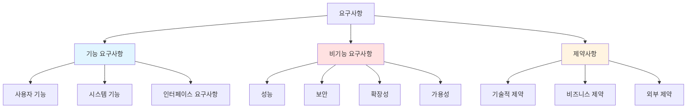

# 요구사항 (Requirements)
{: .no_toc }

프로젝트의 목표와 필요한 기능을 정의하는 단계입니다.
{: .fs-6 .fw-300 }

---

## 목차
{: .no_toc .text-delta }

1. TOC
{:toc}

---

## 개요

요구사항 분석은 소프트웨어 개발의 첫 번째 단계로, 프로젝트의 성공을 결정짓는 중요한 과정입니다.

### 🎯 목적

- 프로젝트의 명확한 목표 설정
- 이해관계자의 요구사항 수집 및 분석
- 개발 범위 정의 및 우선순위 결정
- 프로젝트 성공 기준 수립

### 📋 요구사항 분류



---

## 📑 문서 구성

### [기능 요구사항 (Functional Requirements)](functional/)
시스템이 **무엇을** 해야 하는지 정의합니다.
- 사용자 스토리 / Use Case
- 핵심 기능 명세
- 비즈니스 로직

### [비기능 요구사항 (Non-Functional Requirements)](non-functional/)
시스템이 **어떻게** 동작해야 하는지 정의합니다.
- 성능 요구사항
- 보안 요구사항
- 확장성 및 가용성
- 사용성 및 접근성

### [제약사항 (Constraints)](constraints/)
프로젝트 수행 시 고려해야 할 제한사항을 정의합니다.
- 기술적 제약사항
- 비즈니스 제약사항
- 법적/규제 제약사항

---

## ✅ 작성 체크리스트

요구사항 문서 작성 시 다음 항목들을 확인하세요:

- [ ] **명확성**: 요구사항이 모호하지 않고 명확한가?
- [ ] **완전성**: 모든 필요한 요구사항이 포함되었는가?
- [ ] **일관성**: 요구사항 간 모순이 없는가?
- [ ] **측정 가능성**: 요구사항이 검증 가능한가?
- [ ] **추적 가능성**: 각 요구사항의 출처가 명확한가?
- [ ] **우선순위**: 요구사항의 중요도가 정의되었는가?

---

## 🤖 AI 활용 팁

요구사항 작성 시 AI를 활용하는 방법:

1. **초안 생성**: 프로젝트 개요를 AI에게 설명하고 요구사항 초안 생성
2. **상세화**: AI가 생성한 초안을 바탕으로 질문을 통해 구체화
3. **검증**: AI에게 요구사항 간 모순 여부 확인 요청
4. **우선순위**: AI와 함께 요구사항 우선순위 논의

> 💡 **프롬프트 예시**: `templates/00-requirements-prompt.md` 참고

---

## 📊 요구사항 우선순위

### MoSCoW 방법

| 분류 | 설명 | 표시 |
|------|------|------|
| **Must have** | 프로젝트 성공을 위해 반드시 필요 | 🔴 |
| **Should have** | 중요하지만 필수는 아님 | 🟡 |
| **Could have** | 있으면 좋지만 없어도 됨 | 🟢 |
| **Won't have** | 이번 릴리즈에서는 제외 | ⚪ |

---

## 📝 작성 가이드

### 좋은 요구사항의 특징

✅ **Good Example**
```
사용자는 로그인 후 5초 이내에 대시보드를 볼 수 있어야 한다.
- 측정 가능 (5초)
- 명확한 조건 (로그인 후)
- 구체적인 결과 (대시보드 표시)
```

❌ **Bad Example**
```
시스템은 빨라야 한다.
- 측정 불가능
- 모호한 표현
- 구체적이지 않음
```

---

## 다음 단계

요구사항 분석이 완료되면:
1. ✅ 이해관계자 검토 및 승인
2. 🏗️ [High Level Design (HLD)](../hld/) 단계로 진행
3. 📋 요구사항 추적 매트릭스 작성

---

**참고 자료**:
- [IEEE 830: 소프트웨어 요구사항 명세 표준](https://standards.ieee.org/)
- [요구사항 공학 (Requirements Engineering)](https://www.reqview.com/doc/requirements-engineering.html)
