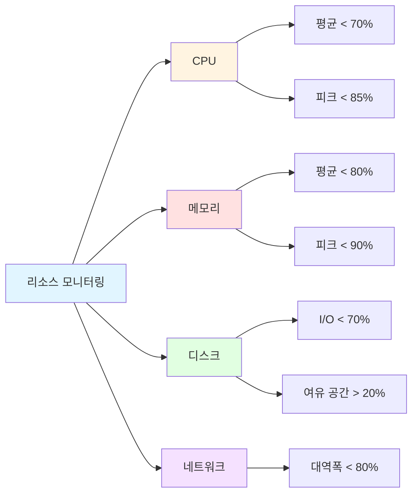
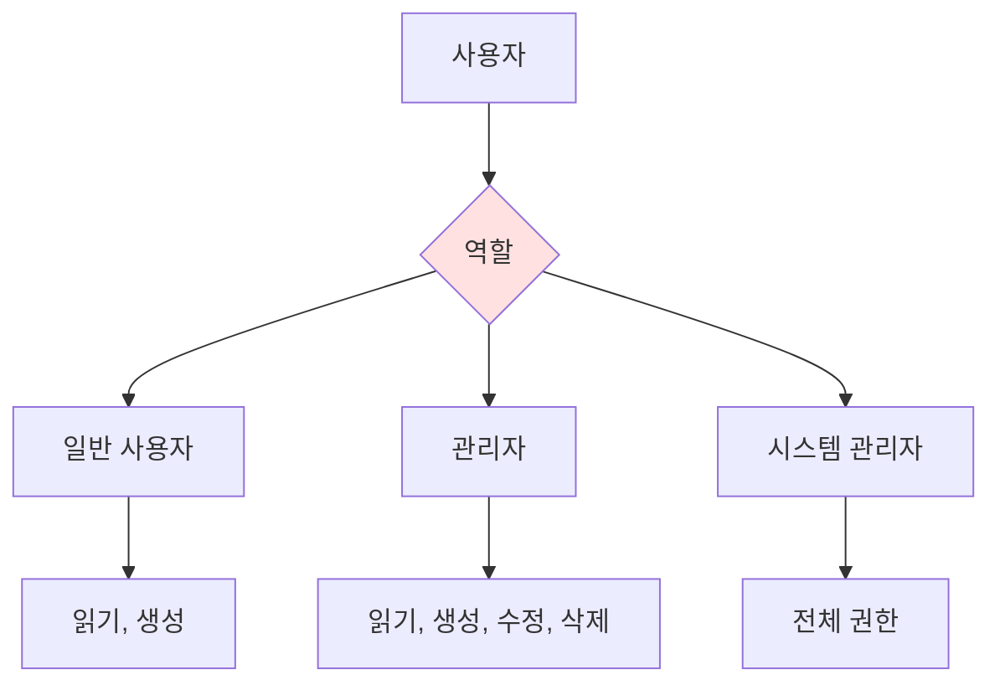

# 비기능 요구사항 (Non-Functional Requirements)
{: .no_toc }

시스템이 **어떻게** 동작해야 하는지 정의하는 문서입니다.
{: .fs-6 .fw-300 }

---

## 목차
{: .no_toc .text-delta }

1. TOC
{:toc}

---

## 개요

비기능 요구사항은 시스템의 품질 속성(Quality Attributes)을 정의하며, 성능, 보안, 확장성 등 시스템의 운영 특성을 기술합니다.

---

## 1. 성능 요구사항 (Performance)

### 1.1 응답 시간

| 작업 유형 | 목표 시간 | 최대 시간 | 측정 기준 |
|-----------|-----------|-----------|-----------|
| 페이지 로드 | < 1초 | < 2초 | 95 백분위수 |
| API 응답 (단순 조회) | < 200ms | < 500ms | 평균 |
| API 응답 (복잡 조회) | < 500ms | < 1초 | 평균 |
| 검색 쿼리 | < 500ms | < 1초 | 95 백분위수 |
| 파일 업로드 (10MB) | < 5초 | < 10초 | 평균 |

### 1.2 처리량 (Throughput)

**NFR-001: API 처리량**
- **목표**: 초당 1,000 요청 (RPS) 처리
- **피크**: 초당 2,000 요청 처리
- **측정 방법**: 부하 테스트 (JMeter, k6)

**NFR-002: 동시 사용자**
- **목표**: 동시 접속자 5,000명 지원
- **피크**: 동시 접속자 10,000명 지원
- **세션 관리**: Redis 기반 세션 스토어

### 1.3 리소스 사용량



**NFR-003: CPU 사용률**
- 평균 사용률 < 70%
- 피크 사용률 < 85%

**NFR-004: 메모리 사용률**
- 평균 사용률 < 80%
- 메모리 누수 없음 (24시간 연속 실행)

**NFR-005: 데이터베이스**
- 연결 풀: 최소 10, 최대 100
- 쿼리 실행 시간: 평균 < 100ms
- 인덱스 적용: 모든 WHERE 조건 컬럼

---

## 2. 확장성 (Scalability)

### 2.1 수평 확장 (Horizontal Scaling)

**NFR-010: 무상태 설계 (Stateless)**
- 모든 애플리케이션 서버는 무상태로 설계
- 세션 데이터는 Redis에 저장
- 로드 밸런서를 통한 자동 분산

**NFR-011: 데이터베이스 샤딩**
- 사용자 ID 기반 샤딩 지원
- 100만 사용자까지 단일 DB
- 100만 이상 시 샤딩 전략 적용

### 2.2 수직 확장 (Vertical Scaling)

**NFR-012: 리소스 증설**
- CPU/메모리 증설 시 재시작 불필요
- 클라우드 인스턴스 타입 변경 지원

---

## 3. 가용성 (Availability)

### 3.1 서비스 수준 목표 (SLO)

**NFR-020: 가동 시간 (Uptime)**
- **목표**: 99.9% (연간 약 8.76시간 다운타임)
- **측정**: 월별 가동률 계산
- **제외**: 계획된 유지보수 시간

```
가동률 = (전체 시간 - 다운타임) / 전체 시간 × 100
```

### 3.2 장애 복구

**NFR-021: 복구 시간 목표 (RTO)**
- **중대 장애**: 1시간 이내 복구
- **일반 장애**: 4시간 이내 복구
- **경미한 장애**: 24시간 이내 복구

**NFR-022: 복구 시점 목표 (RPO)**
- **데이터 손실 허용 한계**: 최대 5분
- **백업 주기**: 매 1시간
- **실시간 복제**: Primary-Replica 구성

### 3.3 무중단 배포

**NFR-023: Blue-Green 배포**
- 무중단 배포 지원
- 롤백 가능 (5분 이내)
- 헬스 체크 자동화

---

## 4. 보안 (Security)

### 4.1 인증 및 인가

**NFR-030: 인증 방식**
- JWT 기반 토큰 인증
- 액세스 토큰 만료: 1시간
- 리프레시 토큰 만료: 7일
- HTTPS 필수

**NFR-031: 비밀번호 정책**
- 최소 길이: 8자
- 복잡도: 영문 대소문자 + 숫자 + 특수문자 중 3종 이상
- 해싱 알고리즘: bcrypt (cost factor 12)
- 재사용 제한: 최근 3개 비밀번호 재사용 불가

### 4.2 데이터 보호

**NFR-032: 암호화**
- **전송 중**: TLS 1.3
- **저장 시**: AES-256
- **민감 정보**: 개인정보, 금융정보 필드 단위 암호화

**NFR-033: SQL Injection 방지**
- ORM 사용 또는 Prepared Statement
- 사용자 입력값 검증 및 이스케이프

**NFR-034: XSS 방지**
- 모든 출력값 HTML 인코딩
- Content Security Policy (CSP) 적용

**NFR-035: CSRF 방지**
- CSRF 토큰 사용
- SameSite 쿠키 속성 설정

### 4.3 접근 제어

**NFR-036: 역할 기반 접근 제어 (RBAC)**


**NFR-037: API Rate Limiting**
- 일반 사용자: 분당 100 요청
- 인증된 사용자: 분당 1,000 요청
- 초과 시: 429 Too Many Requests

### 4.4 감사 로그

**NFR-038: 로그 기록**
- 모든 인증 시도 (성공/실패)
- 권한 변경 이력
- 민감 데이터 접근 이력
- 로그 보관 기간: 1년

---

## 5. 사용성 (Usability)

### 5.1 사용자 인터페이스

**NFR-040: 반응형 디자인**
- 모바일: 320px ~ 767px
- 태블릿: 768px ~ 1023px
- 데스크톱: 1024px 이상

**NFR-041: 브라우저 지원**
- Chrome (최신 2개 버전)
- Firefox (최신 2개 버전)
- Safari (최신 2개 버전)
- Edge (최신 2개 버전)

### 5.2 접근성 (Accessibility)

**NFR-042: WCAG 2.1 Level AA 준수**
- 키보드 네비게이션 지원
- 스크린 리더 호환
- 충분한 색상 대비 (4.5:1)
- 대체 텍스트 제공

**NFR-043: 다국어 지원**
- 한국어 (기본)
- 영어 (선택)
- 언어 전환 기능

---

## 6. 유지보수성 (Maintainability)

### 6.1 코드 품질

**NFR-050: 코드 커버리지**
- 단위 테스트: 최소 80%
- 통합 테스트: 최소 70%
- E2E 테스트: 주요 시나리오 100%

**NFR-051: 코드 복잡도**
- Cyclomatic Complexity < 10
- 함수 길이 < 50줄
- 클래스 크기 < 500줄

**NFR-052: 정적 분석**
- ESLint / Pylint 규칙 준수
- SonarQube 품질 게이트 통과

### 6.2 문서화

**NFR-053: API 문서**
- OpenAPI (Swagger) 명세
- 모든 엔드포인트 설명 및 예시
- 자동 생성 및 동기화

**NFR-054: 코드 주석**
- Public API: JSDoc / Docstring
- 복잡한 로직: 인라인 주석

---

## 7. 운영성 (Operability)

### 7.1 모니터링

**NFR-060: 헬스 체크**
- `/health` 엔드포인트 제공
- 응답 시간 < 100ms
- 의존성 상태 포함 (DB, Redis, 외부 API)

**NFR-061: 메트릭 수집**
- 애플리케이션 메트릭 (Prometheus)
- 비즈니스 메트릭 (사용자 수, 거래 수)
- 인프라 메트릭 (CPU, 메모리, 네트워크)

**NFR-062: 로그 관리**
- 구조화된 로그 (JSON)
- 로그 레벨: ERROR, WARN, INFO, DEBUG
- 중앙 집중식 로그 (ELK Stack)

### 7.2 알림

**NFR-063: 알림 정책**
- **Critical**: 즉시 알림 (SMS, Slack)
- **Warning**: 5분 이내 알림 (이메일, Slack)
- **Info**: 일일 리포트

---

## 8. 호환성 (Compatibility)

### 8.1 플랫폼 호환성

**NFR-070: 운영체제**
- Linux (Ubuntu 20.04+, CentOS 8+)
- Docker 컨테이너 환경

**NFR-071: 데이터베이스**
- PostgreSQL 13+
- MySQL 8.0+
- MongoDB 5.0+ (선택)

### 8.2 통합 호환성

**NFR-072: API 버전 관리**
- Semantic Versioning (MAJOR.MINOR.PATCH)
- 하위 호환성 유지 (최소 1년)
- 버전 명시: `/api/v1/...`

---

## 9. 규정 준수 (Compliance)

### 9.1 법적 요구사항

**NFR-080: 개인정보보호법**
- 개인정보 수집 동의
- 개인정보 처리방침 공개
- 개인정보 열람/삭제 요청 처리

**NFR-081: 데이터 보관**
- 법적 보관 의무: 최소 3년
- 삭제 요청 처리: 30일 이내

---

## 10. 비기능 요구사항 매트릭스

| 카테고리 | 요구사항 ID | 우선순위 | 측정 방법 | 목표 값 |
|----------|-------------|----------|-----------|---------|
| 성능 | NFR-001 | 🔴 | 부하 테스트 | 1,000 RPS |
| 가용성 | NFR-020 | 🔴 | 모니터링 | 99.9% |
| 보안 | NFR-030 | 🔴 | 코드 리뷰 | JWT 인증 |
| 확장성 | NFR-010 | 🟡 | 아키텍처 리뷰 | 무상태 설계 |
| 사용성 | NFR-040 | 🟡 | 수동 테스트 | 반응형 지원 |

---

## ✅ 완료 체크리스트

- [ ] 성능 목표 수치 정의 완료
- [ ] 보안 요구사항 명세 완료
- [ ] 가용성 SLO 정의 완료
- [ ] 모니터링 전략 수립 완료
- [ ] 규정 준수 항목 확인 완료
- [ ] 이해관계자 리뷰 완료

---

**다음 단계**: [제약사항](constraints/) 작성
