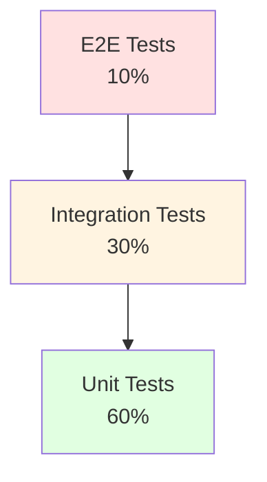

# 테스트 전략 (Test Strategy)
{: .no_toc }

품질 보증을 위한 테스트 계획을 수립합니다.
{: .fs-6 .fw-300 }

---

## 개요

테스트 전략은 소프트웨어 품질을 보장하기 위한 체계적인 테스트 접근 방법을 정의합니다.

### 🎯 목적

- 테스트 범위 및 우선순위 설정
- 테스트 레벨 정의 (Unit, Integration, E2E)
- 품질 메트릭 및 커버리지 목표 수립

---

## 📊 테스트 피라미드

---

## 📑 문서 구성

### [테스트 계획 (Test Plan)](test-plan/)
테스트 범위, 일정, 리소스를 계획합니다.

### [테스트 케이스 (Test Cases)](test-cases/)
구체적인 테스트 케이스를 작성합니다.

### [품질 메트릭 (Quality Metrics)](quality-metrics/)
품질 목표와 측정 방법을 정의합니다.

---

## ✅ 완료 체크리스트

- [ ] 테스트 계획 수립 완료
- [ ] 테스트 케이스 작성 완료
- [ ] 품질 메트릭 정의 완료
